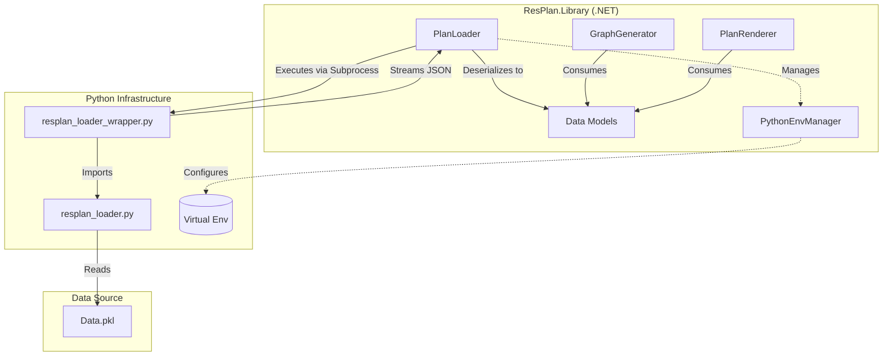
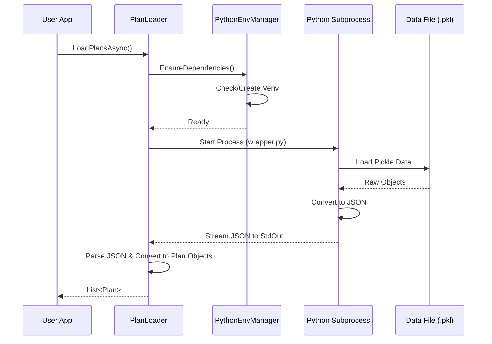
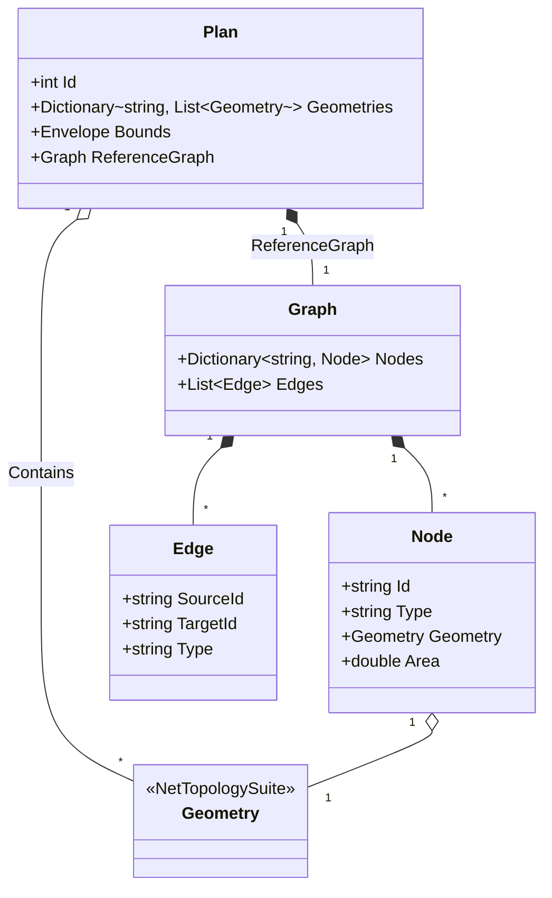

# ResPlan.NET Documentation

This document provides a comprehensive technical overview of the ResPlan.NET library, including its architecture, internal data loading mechanisms, and data models. It is designed to provide AI agents and developers with deep context on the system's operation.

## Architecture Overview

ResPlan.NET bridges .NET and Python to leverage the specific data format of the ResPlan dataset. The core library (`ResPlan.Library`) handles the high-level logic, object modeling, graph generation, and rendering in .NET, while delegating the complex parsing of the original `.pkl` data files to a Python subprocess.



## Internal Mechanisms

### Data Loading (Python Integration)

The `PlanLoader` does not parse the `.pkl` files directly in C#. Instead, it orchestrates a Python subprocess to perform this task. This ensures compatibility with the original data format without reimplementing complex `pickle` logic in .NET.

**Process Flow:**
1.  **Dependency Check**: `PythonEnvManager` ensures a local virtual environment exists and required packages (e.g., `shapely`, `networkx`, `numpy`) are installed.
2.  **Execution**: `PlanLoader` invokes `resplan_loader_wrapper.py` using the Python interpreter from the virtual environment.
3.  **Data Streaming**: The Python script loads the `.pkl` data, converts it to a clean JSON structure, and prints it to `stdout`.
4.  **Deserialization**: `PlanLoader` captures `stdout`, extracts the JSON payload, and deserializes it into `ResPlanData` C# objects, which are then converted to the rich `Plan` domain model.



## Data Models

The library uses a set of rich domain models to represent floorplans and their connectivity graphs.

### Class Diagram



### Type Definitions

*   **`Plan`**: The root object representing a single floorplan.
    *   `Geometries`: A dictionary mapping category names (e.g., "living", "wall", "door") to lists of NetTopologySuite `Geometry` objects.
    *   `Bounds`: The spatial bounding box of the plan.
    *   `ReferenceGraph`: The ground-truth graph provided by the dataset (if available).
*   **`Graph`**: Represents the connectivity graph of the floorplan.
    *   Generated by `GraphGenerator` or loaded as `ReferenceGraph`.
*   **`Node`**: A node in the graph, typically representing a room or a portal (door/window).
    *   `Type`: The semantic type (e.g., "living", "kitchen").
    *   `Geometry`: The specific geometry associated with this node.
*   **`Edge`**: A connection between two nodes.
    *   `Type`: The nature of the connection (e.g., "adjacency", "direct").

## API Reference

### `ResPlan.Library.PlanLoader`

Handles the loading of plan data.

*   `static Task<List<Plan>> LoadPlansAsync(string jsonPath = null, string pklPathOverride = null, int? maxItems = null)`
    *   **jsonPath**: Optional path to a pre-converted JSON file. If provided, skips Python execution.
    *   **pklPathOverride**: Optional path to a specific `.pkl` file. If null, defaults to the managed dataset path.
    *   **maxItems**: Optional limit on the number of plans to load.
    *   **Returns**: A list of `Plan` objects.

### `ResPlan.Library.GraphGenerator`

Generates connectivity graphs from `Plan` geometries.

*   `static Graph GenerateGraph(Plan plan)`
    *   Analyzes geometry intersections and adjacencies to build a graph.
    *   **Logic**:
        *   Creates nodes for all rooms, doors, and windows.
        *   Connects "front_door" to "living" if they intersect (buffered).
        *   Connects rooms (kitchen/bedroom) to "living" if adjacent.
        *   Connects rooms via "door" or "window" geometries.
    *   **Returns**: A new `Graph` object.

### `ResPlan.Library.PlanRenderer`

Visualizes plans using SkiaSharp.

*   `static void Render(Plan plan, string outputPath, int width = 800, int height = 800)`
    *   **plan**: The plan to render.
    *   **outputPath**: File path for the resulting PNG image.
    *   **width/height**: Dimensions of the output image.
    *   **Details**:
        *   Automatically scales the plan to fit the image dimensions.
        *   Uses a predefined color palette for different room types.
        *   Renders polygons with fills and strokes.

## Testing

Tests are located in `ResPlan.Tests` and use xUnit.

To run tests:
```bash
dotnet test ResPlan.Tests
```

**Note**: The tests use a truncated sample dataset (`sample.pkl`) to verify the loading pipeline without downloading the full dataset.
