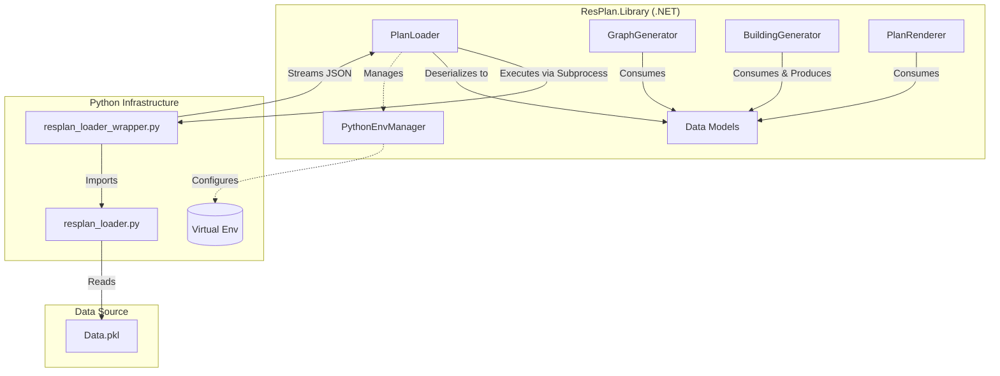
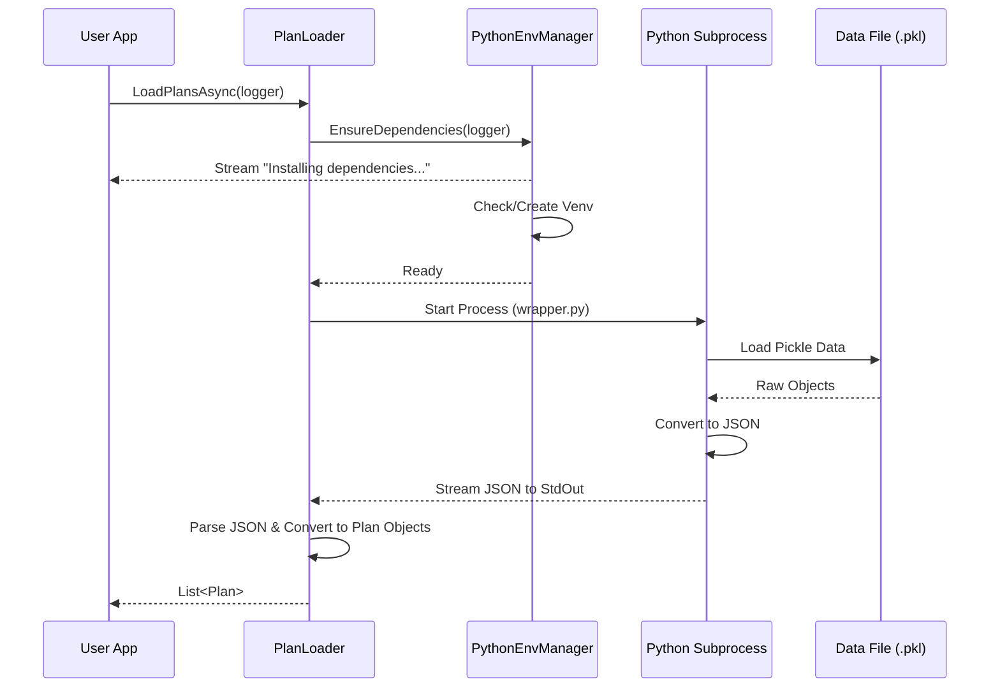
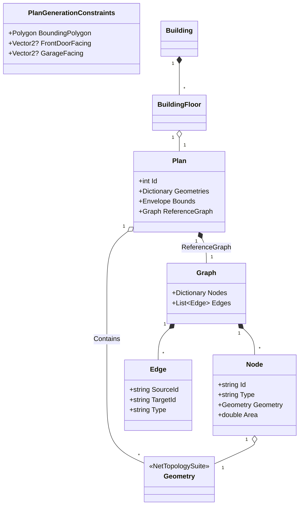

# ResPlan.NET Documentation

This document provides a comprehensive technical overview of the ResPlan.NET library, including its architecture, internal data loading mechanisms, and data models. It is designed to provide AI agents and developers with deep context on the system's operation.

## Architecture Overview

ResPlan.NET bridges .NET and Python to leverage the specific data format of the ResPlan dataset. The core library (`ResPlan.Library`) handles the high-level logic, object modeling, graph generation, and rendering in .NET, while delegating the complex parsing of the original `.pkl` data files to a Python subprocess.



## Internal Mechanisms

### Data Loading (Python Integration)

The `PlanLoader` does not parse the `.pkl` files directly in C#. Instead, it orchestrates a Python subprocess to perform this task. This ensures compatibility with the original data format without reimplementing complex `pickle` logic in .NET.

**Process Flow:**
1.  **Dependency Check**: `PythonEnvManager` ensures a local virtual environment exists and required packages (e.g., `shapely`, `networkx`, `numpy`) are installed. It streams progress (e.g., pip install output) via a provided logger.
2.  **Execution**: `PlanLoader` invokes `resplan_loader_wrapper.py` using the Python interpreter from the virtual environment.
3.  **Data Streaming**: The Python script loads the `.pkl` data, converts it to a clean JSON structure, and prints it to `stdout`.
4.  **Deserialization**: `PlanLoader` captures `stdout`, extracts the JSON payload, and deserializes it into `ResPlanData` C# objects, which are then converted to the rich `Plan` domain model.



## Data Models

The library uses a set of rich domain models to represent floorplans and their connectivity graphs.

### Class Diagram



### Type Definitions

*   **`Building`**: Represents a multi-story structure.
    *   `Floors`: A list of `BuildingFloor` objects sorted by floor number.
*   **`BuildingFloor`**: A single floor in a building.
    *   `Plan`: The floorplan associated with this level.
    *   `AdditionalGeometries`: Generated common areas (e.g., stairs, corridors) not present in the original plan.
*   **`Plan`**: The root object representing a single floorplan.
    *   `Geometries`: A dictionary mapping category names (e.g., "living", "wall", "door") to lists of NetTopologySuite `Geometry` objects.
    *   `Bounds`: The spatial bounding box of the plan.
    *   `ReferenceGraph`: The ground-truth graph provided by the dataset (if available).
*   **`PlanGenerationConstraints`**: Configuration for filtering and orienting loaded plans.
    *   `BoundingPolygon`: A polygon that must fully contain the plan's bounds.
    *   `FrontDoorFacing`: A target vector for the front door's orientation relative to the plan's center.
    *   `GarageFacing`: *Unsupported in current dataset*.
*   **`Graph`**: Represents the connectivity graph of the floorplan.
    *   Generated by `GraphGenerator` or loaded as `ReferenceGraph`.
*   **`Node`**: A node in the graph, typically representing a room or a portal (door/window).
    *   `Type`: The semantic type (e.g., "living", "kitchen").
    *   `Geometry`: The specific geometry associated with this node.
*   **`Edge`**: A connection between two nodes.
    *   `Type`: The nature of the connection (e.g., "adjacency", "direct").

## API Reference

### `ResPlan.Library.PlanLoader`

Handles the loading of plan data.

*   `static Task<List<Plan>> LoadPlansAsync(string jsonPath = null, string pklPathOverride = null, int? maxItems = null, Action<string> logger = null, PlanGenerationConstraints constraints = null)`
    *   **jsonPath**: Optional path to a pre-converted JSON file. If provided, skips Python execution.
    *   **pklPathOverride**: Optional path to a specific `.pkl` file. If null, defaults to the managed dataset path.
    *   **maxItems**: Optional limit on the number of plans to load.
    *   **logger**: Optional callback to receive real-time progress updates (e.g., dependency installation logs, download progress).
    *   **constraints**: Optional `PlanGenerationConstraints` to filter or orient plans.
        *   **BoundingPolygon**: If set, only plans whose bounds are completely contained within this polygon are returned.
        *   **FrontDoorFacing**: If set, plans are rotated so their front door (vector from center to door) aligns with this vector.
        *   **GarageFacing**: Currently unsupported; will log a warning if set.
    *   **Returns**: A list of `Plan` objects.

### `ResPlan.Library.Data.PlanSerializer`

Helper class for binary serialization using MessagePack.

*   `static byte[] Serialize(Plan plan)` / `static Plan Deserialize(byte[] bytes)`
    *   Serializes/Deserializes `Plan` objects to/from MessagePack binary format.
    *   **Features**:
        *   Supports `double.NaN` and `double.Infinity` (unlike standard JSON).
        *   Uses custom formatters for `NetTopologySuite.Geometries.Geometry` (WKB format) and `Envelope`.
*   `static void SaveToFile(Plan plan, string filePath)` / `static Plan LoadFromFile(string filePath)`
    *   Convenience wrappers for file I/O.

### `ResPlan.Library.GraphGenerator`

Generates connectivity graphs from `Plan` geometries.

*   `static Graph GenerateGraph(Plan plan)`
    *   Analyzes geometry intersections and adjacencies to build a graph.
    *   **Logic**:
        *   Creates nodes for all rooms, doors, and windows.
        *   Connects "front_door" to "living" if they intersect (buffered).
        *   Connects rooms (kitchen/bedroom) to "living" if adjacent.
        *   Connects rooms via "door" or "window" geometries.
    *   **Returns**: A new `Graph` object.

## Building Generation

### `ResPlan.Library.BuildingGenerator`

Procedurally generates multi-story buildings from a set of available plans.

*   `Building GenerateBuilding(List<Plan> availablePlans, int targetFloors)`
    *   Stacks plans to form a coherent building structure.
    *   **Algorithm**:
        1.  **Normalization**: All candidate plans are translated so their "front door" is at (0,0).
        2.  **Sorting**: Plans are sorted by bounding box area (largest first).
        3.  **Stacking**:
            *   Floor 0 is the largest available plan.
            *   Subsequent floors are chosen from the remaining plans such that they "fit" within the previous floor's footprint (checking geometric containment > 95%).
            *   The generator attempts 4 cardinal rotations (0, 90, 180, 270 degrees) to find the best fit.
        4.  **Stairs**: A "stair core" geometry (4x3m) is automatically generated adjacent to the front door for vertical circulation.
    *   **Returns**: A `Building` object containing the stacked floors.

### `ResPlan.Library.PlanRenderer`

Visualizes plans using SkiaSharp.

*   `static void Render(Plan plan, string outputPath, int width = 800, int height = 800)`
    *   Renders a single `Plan`.
*   `static void RenderFloor(BuildingFloor floor, string outputPath, int width = 800, int height = 800)`
    *   **floor**: The `BuildingFloor` to render.
    *   **Details**:
        *   Combines the `Plan` geometries with `AdditionalGeometries` (e.g., stairs).
        *   Renders "stairs" in a distinct color (DarkBlue).

## Testing

Tests are located in `ResPlan.Tests` and use xUnit.

To run tests:
```bash
dotnet test ResPlan.Tests
```

**Note**: The tests use a truncated sample dataset (`sample.pkl`) to verify the loading pipeline without downloading the full dataset.
